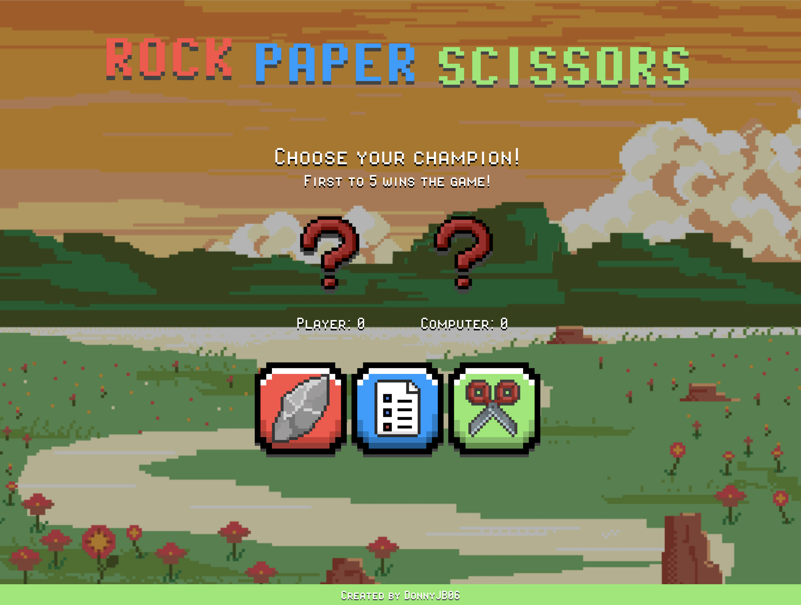
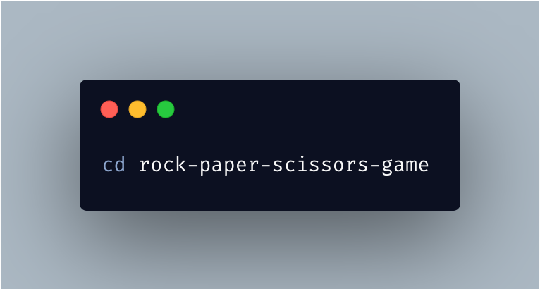

# Rock Paper Scissors Game

Welcome to the Rock Paper Scissors Game! This game features cool animations and a retro pixel design UI completely made by me, bringing a nostalgic feel to a classic game. Play against the CPU and see if you can reach 5 points first to win the game!

## Features
- Cool Animations: Enjoy smooth and engaging animations for each action and result.

- Retro Pixel Design: Relive the old-school gaming experience with a beautifully crafted pixel art interface.

- Score Tracking: The game keeps track of both player and CPU scores.

- End Game Screen: A special screen displays the final results when a player wins.

## How to Play
1. **Choose Your Champion: Click on the Rock, Paper, or Scissors icon to make your choice.**

2. **CPU Makes a Choice: The CPU randomly selects Rock, Paper, or Scissors.**

3. **Round Result: The game displays the result of each round, updating the scores accordingly.**

4. **First to 5 Wins: The first player (either you or the CPU) to reach 5 points wins the game.

5. **Reset to Play Again: Use the reset button to start a new game.**

## Installation
1. **Clone the Repository**:
    

2. **Navigate to the Project Directory**:
    

3. **Open `index.html` in Your Browser**: Simply open the `index.html` file in your favorite web browser to start playing.

## Usage

- **Playing the Game**: Click on the images representing Rock, Paper, or Scissors to make your move.
- **Viewing Results**: See the results of each round displayed in the designated area.
- **Resetting the Game**: Click the reset button to start a new game.

## Code Overview

### HTML

The main structure of the game is defined in `index.html`, which includes the score display, choice buttons, and result messages.

### CSS

The retro pixel design and animations are handled by the styles in `style.css`. This file ensures the game has an authentic old-school look and feel.

### JavaScript

The game logic, including score tracking and determining the winner, is implemented in `app.js`. This file contains the functions that make the game interactive and responsive.

## Contributing

Contributions are welcome! If you'd like to improve the game or add new features, feel free to fork the repository and submit a pull request.

## Contact

For any questions or suggestions, feel free to reach out to the project maintainer at [djabbar@gmail.com](mailto:djabbar51@gmail.com).

Enjoy the game and may the best player win!